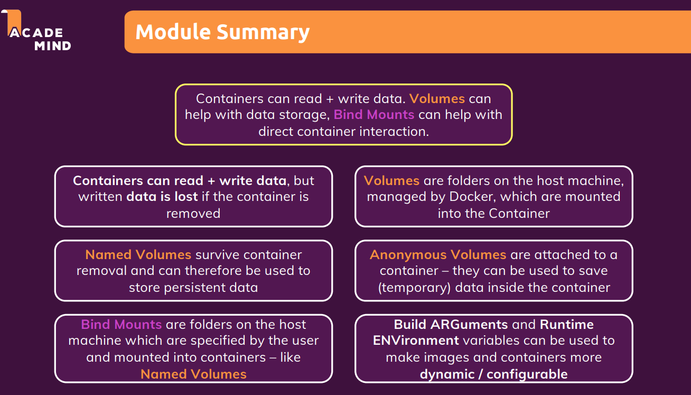
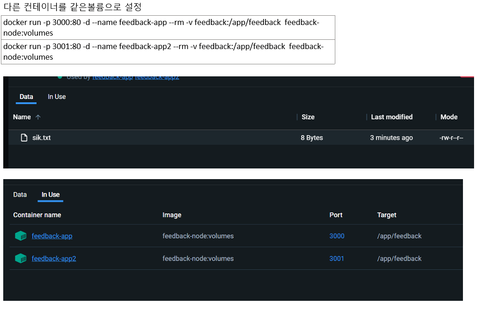
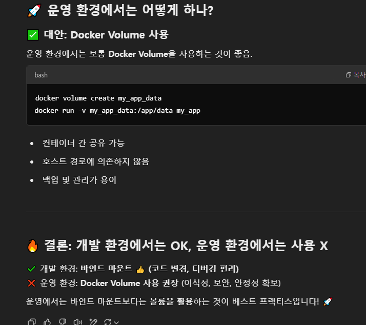
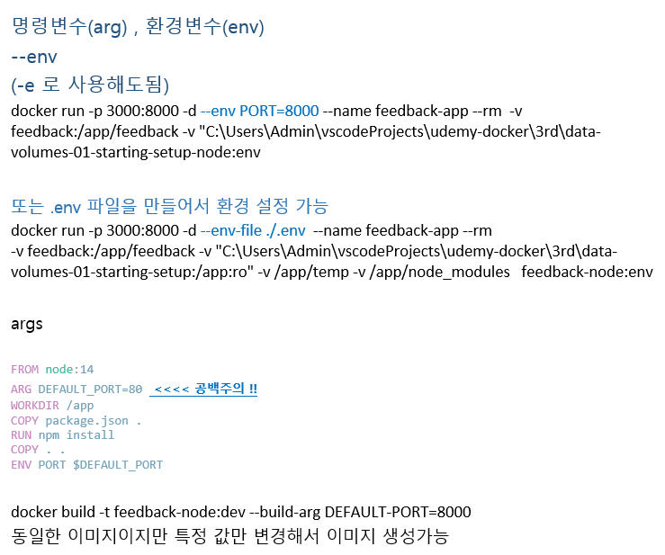

컨테이너는 휘발성이기때문에,
볼륨의 역할은
저장을 필요로 하는 정보들을 (로그, 데이터)
호스트머신에 연동하여 해당 정보들을 저장

1. 지정볼륨(Named Volume) : 컨테이너를 삭제하여도 존재하며, 데이터간 공유가 가능.
    ++ 로그, 데이터베이스 데이터

2. 익명볼륨(Anonymous Volume) : 임시저장, 즉 컨테이너 종료시 삭제, 컨테이너간 데이터 공유 불가
     (의존성 파일 ex. node_moudles)
   ++ 바인트마운트시 덮어쓰기 제외 역할을 수행하기도 한다. 
3. 바인트마운트(Bind Mounts) : 호스트에 존재하여, 컨테이너 종료하여도 존재한다. 
   - 런타임환경에서 컨테이너와 호스트머신 동적으로 연결하기때문에 실시간 반영이 가능하다.
   $$ 
   바인트 마운트는 개발환경에서만 사용하는 것이 좋을 것같다

# Copy 와 바인트 마운트 어떻게 사용해야할까??

Docker에서 Copy와 바인드 마운트는 데이터를 컨테이너에 전달하는 두 가지 주요 방법입니다.
1. COPY (복사)

Dockerfile에서 사용되는 명령어
호스트의 파일/디렉토리를 이미지 내부로 영구적으로 복사
이미지 빌드 시점에 파일을 컨테이너 내부에 포함
이미지의 일부가 되어 불변성 유지
빌드 시간에 파일 추가에 적합

dockerfileCopy# 예시
COPY ./source /app/destination

2. 바인드 마운트 (Bind Mount)

런타임에 호스트의 파일/디렉토리를 컨테이너에 동적으로 연결
호스트와 컨테이너 간 실시간 파일 공유
개발 환경에서 소스코드 변경 실시간 반영에 유용
컨테이너 외부에서 파일 수정 가능

bashCopy# Docker Run 시 바인드 마운트 예시
docker run -v /host/path:/container/path myimage

## 주요 차이점

권장 사용 패턴

프로덕션: COPY 사용 (이미지 불변성)
개발: 바인드 마운트 사용 (실시간 개발)

** 개발환경에서 어떻게 사용을 하는지 
  java 같은 경우에는 

# igonre을 해야 하는 경우 

1. 액세스 키
2. 암호화 키 

보안
- 액세스키 등 보안과 관련된 정보는 그냥 image에 넣지 말고 docker run할때 환경변수로 넣자.

